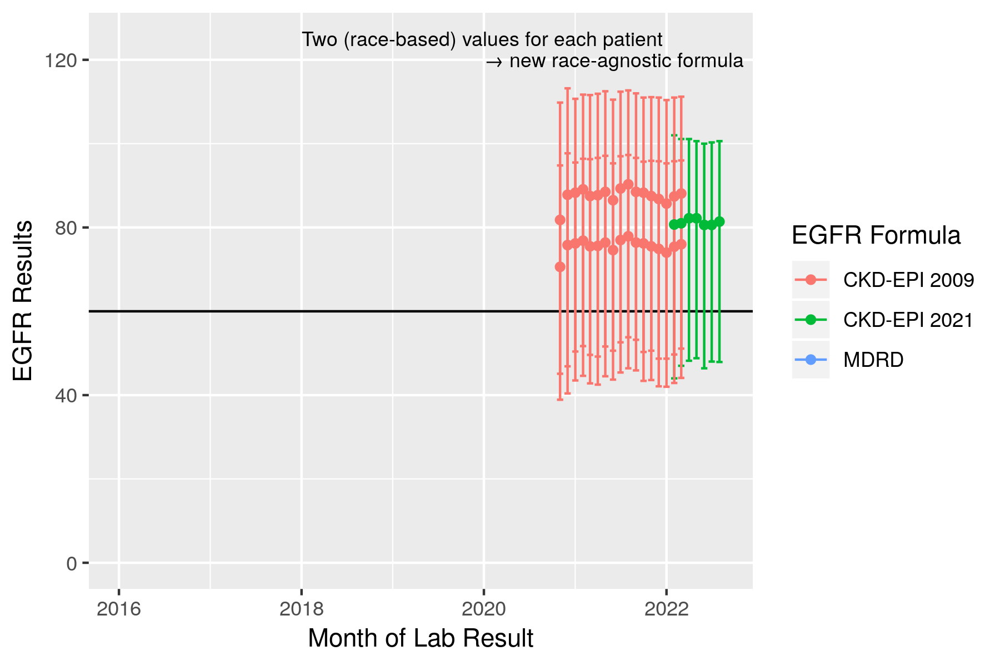
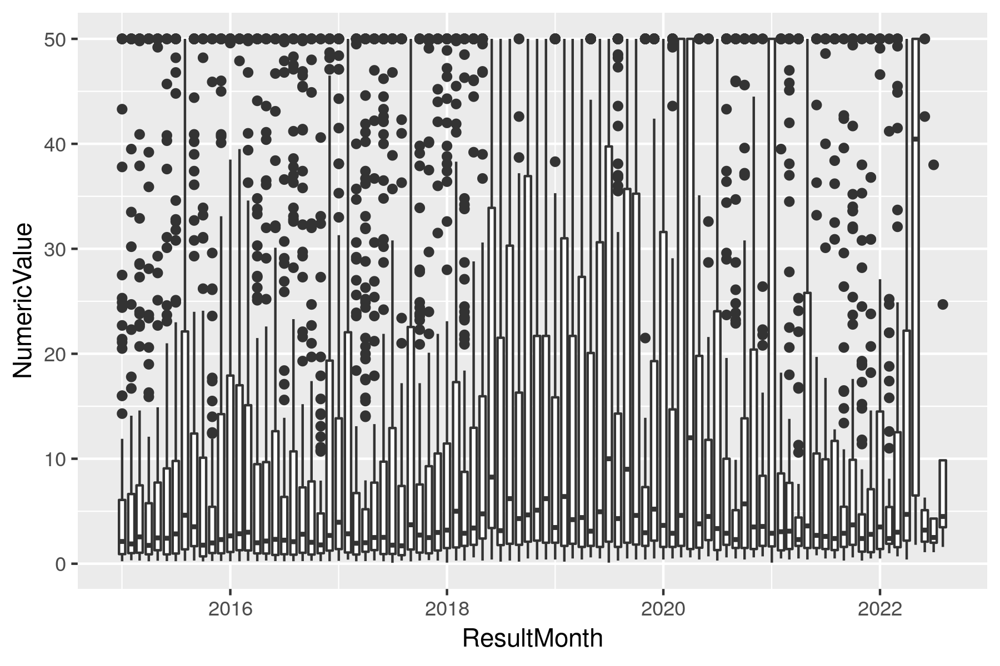
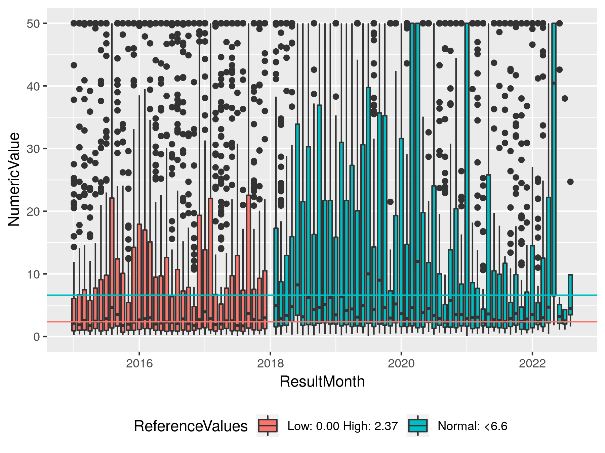

For both humans and AI, practice makes perfect; the difference is how efficiently we learn. Humans can sense subtle differences in each repetition and quickly feed that back into whatever we are doing: surfing, painting, or driving. Those activities would be much more difficult if your tools didn’t function the same way each time. The surfboard changed weight and speed on each wave, your paint brush was randomly thicker or longer with each stroke, or your car’s steering wheel was straight in a different position after each turn. Humans could maybe adapt to this stochasticity (with direct visual feedback) but static AI models (learned on the past and applied to the future without feedback) would naively fit to the average and struggle with the extremes.

This is the first installment in a series of musings about challenges in applied AI in medicine where I am aiming to compile anecdotes into advice. This month’s topic is temporal shifts in data, particularly laboratory results. 

Two contrasting examples have came up in my work in recent months: 

1. eGFR (estimated glomerular filtration rate), a common measurement of how well a patient’s kidneys are filtering, and 
2. CKMB (creatine kinase-MB), the amount of a specific heart muscle enzyme found in your blood which may indicate a recent heart attack. 

eGFR is an *estimate* and the formula used was recently revised (to stop using race as a covariate) and the NYU Langone Health (NYULH) laboratory created a new lab result to replace the old one. CKMB is a direct measurement but a change in the laboratory process used at NYULH led to an update in the reference range of ‘normal’ with no new ID in the system. Both changes occurred for legitimate reasons but are exactly the kind of constant ebbing that occurs in a large medical system that can lead to issues for deployed AI systems.

When we build AI systems we need to anticipate these changes as a type of ‘data drift’ [(Davis et al., 2017)](https://academic.oup.com/jamia/article/24/6/1052/3096776) and try to be proactive. One system may use a specific eGFR, e.g. ID = 12345, making it *fragile* to replacements/additions, e.g. a new ID = 54321, requiring careful maintenance to prevent downtime. Conversely, nonspecific systems may use search terms (e.g. any lab matching "EGFR") to be more *robust* and require less maintenance but changes in numeric values given to the AI can cause potentially significant changes in output. With a hands-off ML-Ops approach (or lack of tools) these small data changes may lead to both big-picture performance drift, e.g. the sensitivity or precision, and drastic changes in model output for individual patients (e.g. from treatment to none). 

How should we build AI systems to align with the least of these evils? There isn’t a one-size-fits-all answer other than awareness: 1) using ML-Ops best-practices to track data inputs and model outputs, 2) a census of what data elements are used by which systems, and 3) involvement of AI teams into the wider IT department so that we can be notified of pertinent changes.  

Let’s explore these two examples to discuss what might go wrong with these types of changes. 

## eGFR (estimated glomerular filtration rate)

eGFR has been a topic of popular (medical science) conversation lately as a principal example of how race has been encoded into medical decision-making. The CKD-EPI 2009 formula includes a multiplicative factor of 1.159 if the patient is of African descent [(Levey, Stevens and Schmid, 2009)](https://www.acpjournals.org/doi/abs/10.7326/0003-4819-150-9-200905050-00006). Said another way, if everything else was equal, a black patient will have a 16% higher eGFR than a white patient. Without getting into all of the complexities here, the takeaway is that since chronic kidney disease is often defined by eGFR < 60, the race-based multiplicative factor makes it harder for black patients to meet this diagnostic criteria so fewer receive the care they need. 

A whole host of work has tried to overcome this disparity with more diverse data, removing the race factor, and adding other variables (particularly cystatin C). The end-result was a broad recommendation to transition away from the race-encoded formula. At NYULH this transition started in early 2022 by creating a new lab result for the CKD-EPI 2021 formula and no longer recording values for the older formula. 

*Fig 1. Median and IQR ranges for eGFR results from the 2009 CKD formula and the updated 2021 formula. Note the large impact race has where Black or African American patients have higher values. The new 2021 formula outputs values agnostic to patient race, in the center of the former white vs. black values.*

This cutover from one result to another could break some particularly *fragile* AI models—those that include data from specific lab IDs and require data completeness. Models developed to be *robust* to missing data would start to perform differently if not revised to the new lab ID. If the system is artificially robust by imputing missing data with the training set average or encoding a separate missing indicator, the system will receive entirely missing data causing true high and low eGFR patients to be indistinguishable. Robust systems that flexibly look at any eGFR result will degrade the least by adapting to include the new lab result ID. However, the modified formula will introduce small distributional differences in eGFR that when compounded within the algorithm may affect model performance (again, likely undetected). 

The 2022 change is not even the only major change in eGFR in our database, an even older formula, MDRD, was formerly used. A good data scientist should catch this change before model training but restriction to only the 2009 CKD-EPI formula would mean throwing away older data. Allowing more than one formula into model training can preserve sample size but can also lead to other biases based on time (or clinic/hospital location) based on when/where one formula or methodology is used. 

*Fig 2. Median and IQR ranges for eGFR results from back to 2016. Note that MDRD values are capped at 60 = 'normal' but the effect of race-encoded into the formula can be seen in the lower quartiles where Black patients results ~10 higher. The race-specific lower quartiles smoothly connect from MDRD into 2009 CKD formula suggesting the two formula are very similar and the median (grey line) smoothly joins into the new formula.*

The silver lining for this example is that regardless of the formula used, the resulting values of eGFR fall along the same range where values < 60 are considered abnormal. If our AI systems are built to be flexible to changes in lab IDs (or we update them), normal, high and low eGFR values will be (approximately) the same numeric values and the system will continue to operate without disruption. It is our job as model owners to investigate whether the small data input changes between formulae manifest in meaningful changes in model predictions and performance.

## CKMB (creatine kinase-MB)

CKMB is a much less common lab result used to assist the diagnosis of heart attack (myocardial infarction) in conjunction with other tests (e.g. troponin). CKMB is undetectable in healthy individuals so values higher than normal are clinically significant. Several uears ago, a change in laboratory equipment used at NYULH led to updated reference ranges of what constitutes 'normal' vs. 'abnormal'. Unlike eGFR where a new lab ID replaced the old, this change was made in-place within the same ID. When the change took place, certain numeric values of CKMB went from being abnormal to normal and higher values became more common.

In the following graph, can you tell when this change occurred? (Note: the highest values are capped at 50 here to aid visibility of lower values without affecting the median or quartiles.)

*Fig 3. Monthly boxplots of CKMB results (large values capped at 50).*

Did you guess January 2018? You can see differences in both the median and upper quartiles warranting the revision of the reference ranges. Here is the labeled version:

*Fig 4. Monthly boxplots of CKMB results labeled with reference ranges (large values capped at 50). **Note** that the monthly count of lab results is consistent over this 2018 change; the clinical workflow of ordering the test was unchanged and only the methodology used by the lab change.*

Many AI algorithms and approaches favor continuous inputs over binarized values of normal vs. abnormal but in this case, AI developed on data preceding the change would receive a drastic increase in the percentage of patients with ‘high’ CKMB as the continuous result does not reflect the new reference range. These higher but more likely ‘normal’ results (median more consistently below reference range) could lead to an increase in false positives or over-treatment without careful maintenance. 

(Feature engineering may aid the robustness of such a model. For example, using both a continuous variable and an abnormal flag, or scaling the continuous variable in reference to the reference range, e.g. both 3.6/2.37, and 10.0/6.6 → 1.5 * abnormal.)

## Conclusion

Data input changes are inevitable in healthcare, clinical recommendations and treatments evolve, lab machines are updated etc. This data drift can cause outages in *fragile* systems or almost undetectable artifacts in the outputs and performance of more *robust* systems. Extra build steps and validations may improve the robustness of deployed AI systems but monitoring with MLOps and regular validations of performance are crucial to preserve trust that the system is continuing to work as intended.

## References

1. Davis, S.E. et al. (2017) ‘Calibration drift in regression and machine learning models for acute kidney injury’, Journal of the American Medical Informatics Association: JAMIA, 24(6), pp. 1052–1061. [doi:10.1093/jamia/ocx030](http://dx.doi.org/10.1093/jamia/ocx030).  
2. Levey, A.S., Stevens, L.A. and Schmid, C.H. (2009) ‘A new equation to estimate glomerular filtration rate’, Annals of internal medicine. Available at: [https://www.acpjournals.org/doi/abs/10.7326/0003-4819-150-9-200905050-00006](https://www.acpjournals.org/doi/abs/10.7326/0003-4819-150-9-200905050-000062).